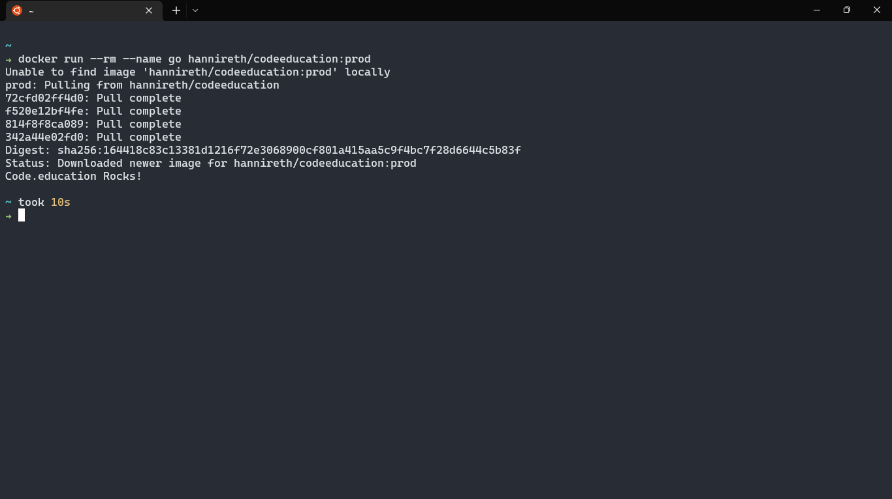
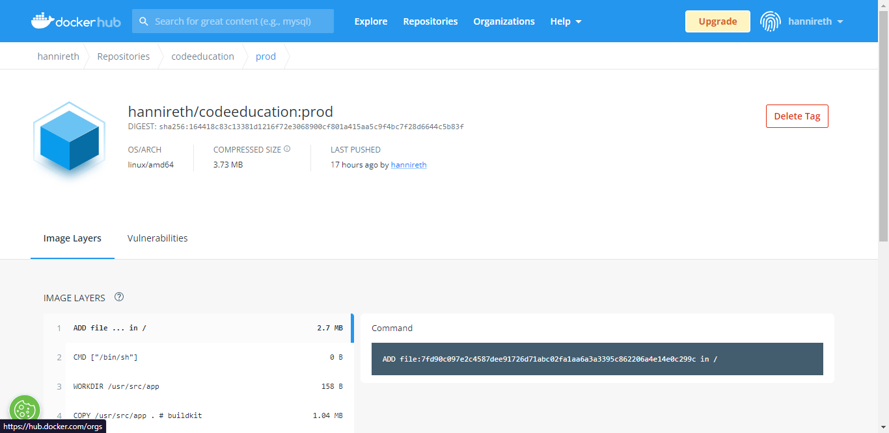

# Full Cycle Docker Challenge 

### **Um container Go Leve**

- Baixe a imagem no Docker Hub com: `docker push hannireth/codeeducation:prod`
  
  
#
[hannireth/codeeducation:prod](https://hub.docker.com/repository/docker/hannireth/codeeducation)

## Sobre o Desafio:
Esse desafio é muito empolgante principalmente se você nunca trabalhou com a linguagem Go!
Você terá que publicar uma imagem no docker hub. Quando executarmos:

- [X] docker run `<seu-user>/codeeducation`

- [X] Temos que ter o seguinte resultado: Code.education Rocks!

- [X] Se você perceber, essa imagem apenas realiza um print da mensagem como resultado final, logo, vale a pena dar uma conferida no próprio site da Go Lang para aprender como fazer um "olá mundo".

- [X] Lembrando que a Go Lang possui imagens oficiais prontas, vale a pena consultar o Docker Hub.

- [x] A imagem de nosso projeto Go precisa ter menos de 2MB =) [^1]

---

